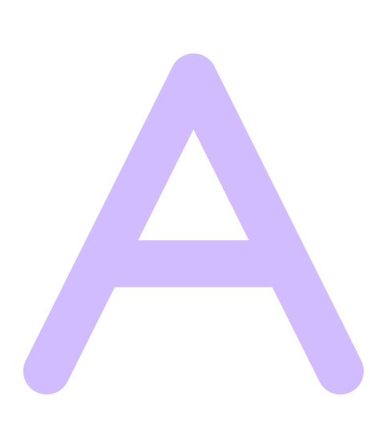

# AriadnevShell

> **Attribution** — AriadnevShell is derived from
> [DankMaterialShell](https://github.com/AvengeMedia/DankMaterialShell) by Avenge Media LLC,
> used under the MIT License. The original copyright notice is retained in `LICENSE`.
> This is an independent fork, not affiliated with or endorsed by Avenge Media.
>
> Note: `ariadnev.vchun.dev` links below are placeholders — the docs site is not up yet.
> Distro packaging under `distro/` still needs COPR / PPA / OBS accounts to be set up.


<div align="center">
  <a href="https://ariadnev.vchun.dev">
    
  </a>

### A modern desktop shell for Wayland

Built with [Quickshell](https://quickshell.org/) and [Go](https://go.dev/)

[](https://ariadnev.vchun.dev/docs)
[](https://github.com/bavanchun/ariadnev-shell/stargazers)
[](https://github.com/bavanchun/ariadnev-shell/blob/master/LICENSE)
[](https://github.com/bavanchun/ariadnev-shell/releases)
[](https://archlinux.org/packages/extra/x86_64/ariadnev-shell/)
[>)](https://aur.archlinux.org/packages/ariadnev-shell-git)
[](https://ko-fi.com/ariadnev)

</div>

AriadnevShell is a complete desktop shell for [niri](https://github.com/YaLTeR/niri), [Hyprland](https://hyprland.org/), [MangoWC](https://github.com/DreamMaoMao/mangowc), [Sway](https://swaywm.org), [labwc](https://labwc.github.io/), [Scroll](https://github.com/dawsers/scroll), [Miracle WM](https://github.com/miracle-wm-org/miracle-wm), and other Wayland compositors. It replaces waybar, swaylock, swayidle, mako, fuzzel, polkit, and everything else you'd normally stitch together to make a desktop.

## Repository Structure

This is a monorepo containing both the shell interface and the core backend services:

```
AriadnevShell/
├── quickshell/         # QML-based shell interface
│   ├── Modules/        # UI components (panels, widgets, overlays)
│   ├── Services/       # System integration (audio, network, bluetooth)
│   ├── Widgets/        # Reusable UI controls
│   └── Common/         # Shared resources and themes
├── core/               # Go backend and CLI
│   ├── cmd/            # advs CLI and advinstall binaries
│   ├── internal/       # System integration, IPC, distro support
│   └── pkg/            # Shared packages
├── distro/             # Distribution packaging
│   ├── fedora/         # Fedora RPM specs
│   ├── debian/         # Debian packaging
│   └── nix/            # NixOS/home-manager modules
└── flake.nix           # Nix flake for declarative installation
```

## See it in Action

<div align="center">

https://github.com/user-attachments/assets/1200a739-7770-4601-8b85-695ca527819a

</div>

<details><summary><strong>More Screenshots</strong></summary>

<div align="center">


</div>

</details>

## Installation

```bash
curl -fsSL https://install.ariadnev.vchun.dev | sh
```

One command installs ADVS and all dependencies on Arch, Fedora, Debian, Ubuntu, openSUSE, or Gentoo.

**[Manual installation guide](https://ariadnev.vchun.dev/docs/advmaterialshell/installation)**

## Features

**Dynamic Theming**
Wallpaper-based color schemes that automatically theme GTK, Qt, terminals, editors (vscode, vscodium), and more using [matugen](https://github.com/InioX/matugen) and adv16.

**System Monitoring**
Real-time CPU, RAM, GPU metrics and temperatures built into the advs daemon (powered by [dgop](https://github.com/AvengeMedia/dgop)). Process list with search and management.

**Powerful Launcher**
Spotlight-style search for applications, files ([dsearch](https://github.com/bavanchun/advsearch)), emojis, running windows, calculator, and commands. Extensible with plugins.

**Control Center**
Unified interface for network, Bluetooth, audio devices, display settings, and night mode.

**Smart Notifications**
Notification center with grouping, rich text support, and keyboard navigation.

**Media Integration**
MPRIS player controls, calendar sync, weather widgets, and clipboard history with image previews.

**Session Management**
Lock screen, idle detection, auto-lock/suspend with separate AC/battery settings, and a settings front-end for [adv-greeter](https://github.com/bavanchun/adv-greeter).

**Plugin System**
Extend functionality with the [plugin registry](https://plugins.ariadnev.vchun.dev). ADVS keeps
`~/.config/AriadnevShell/plugins.lock.json` synchronized with managed plugin installs and
their exact Git commits, so the same plugins can be reproduced on another machine.

## Supported Compositors

Works best with [niri](https://github.com/YaLTeR/niri), [Hyprland](https://hyprland.org/), [Sway](https://swaywm.org/), [MangoWC](https://github.com/DreamMaoMao/mangowc), [labwc](https://labwc.github.io/), [Scroll](https://github.com/dawsers/scroll), and [Miracle WM](https://github.com/miracle-wm-org/miracle-wm) with full workspace switching, overview integration, and monitor management. Other Wayland compositors work with reduced features.

[Compositor configuration guide](https://ariadnev.vchun.dev/docs/advmaterialshell/compositors)

## Command Line Interface

Control the shell from the command line or keybinds:

```bash
advs run              # Start the shell
advs ipc call spotlight toggle
advs ipc call audio setvolume 50
advs ipc call wallpaper set /path/to/image.jpg
advs brightness list  # List available displays
advs plugins search   # Browse plugin registry
advs plugins lock     # Refresh the portable plugin lockfile
advs plugins restore ~/plugins.lock.json
```

[Full CLI and IPC documentation](https://ariadnev.vchun.dev/docs/advmaterialshell/keybinds-ipc)

## Documentation

- **Website:** [ariadnev.vchun.dev](https://ariadnev.vchun.dev)
- **Docs:** [ariadnev.vchun.dev/docs](https://ariadnev.vchun.dev/docs/)
- **Theming:** [Application themes](https://ariadnev.vchun.dev/docs/advmaterialshell/application-themes) | [Custom themes](https://ariadnev.vchun.dev/docs/advmaterialshell/custom-themes)
- **Plugins:** [Development guide](https://ariadnev.vchun.dev/docs/advmaterialshell/plugins-overview)

## Adv Projects

ADVS is one piece of the suite. The rest lives in its own repos:

- [adv-greeter](https://github.com/bavanchun/adv-greeter) - greetd login screen with the Adv Material aesthetic. The Greeter tab in ADVS settings is the front-end for it.
- [advcalendar](https://github.com/bavanchun/advcalendar) - Local, Google, Microsoft, and CalDAV calendars for the adv desktop.
- [dgop](https://github.com/AvengeMedia/dgop) - System monitoring TUI and Go library; its library powers the process list and dashboard widgets inside the advs daemon.
- [dsearch](https://github.com/bavanchun/advsearch) - Fast file search that powers file results in the launcher.
- [ariadnev-qml-common](https://github.com/bavanchun/ariadnev-qml-common) - Shared QML widgets and components used by ADVS, adv-greeter, and advcalendar.
- [dankgo](https://github.com/AvengeMedia/dankgo) - Common Go modules behind the single binary apps.

## Development

See component-specific documentation:

- **[quickshell/](quickshell/)** - QML shell development, widgets, and modules
- **[core/](core/)** - Go backend, CLI tools, and system integration
- **[distro/](distro/)** - Distribution packaging (Fedora, Debian, NixOS)

### Building from Source

**Core + Advinstall:**

```bash
cd core
make              # Build advs CLI
make advinstall  # Build installer
```

**Shell:**

```bash
quickshell -p quickshell/
```

**NixOS:**

```nix
{
  inputs.advs.url = "github:bavanchun/ariadnev-shell";

  # Use in home-manager or NixOS configuration
  imports = [ inputs.advs.homeModules.adv-material-shell ];
}
```

## Contributing

Contributions welcome. Bug fixes, widgets, features, documentation, and plugins all help.

1. Fork the repository
2. Make your changes
3. Test thoroughly
4. Open a pull request

For documentation contributions, see [AdvLinux-Docs](https://github.com/bavanchun/AdvLinux-Docs).

## Credits

- [quickshell](https://quickshell.org/) - Shell framework
- [niri](https://github.com/YaLTeR/niri) - Scrolling window manager
- [Ly-sec](http://github.com/ly-sec) - Wallpaper effects from [Noctalia](https://github.com/noctalia-dev/noctalia-shell)
- [soramanew](https://github.com/soramanew) - [Caelestia](https://github.com/caelestia-dots/shell) inspiration
- [end-4](https://github.com/end-4) - [dots-hyprland](https://github.com/end-4/dots-hyprland) inspiration

## Star History

[](https://star-history.dera.page/#bavanchun/ariadnev-shell&type=date&legend=top-left)

## License

MIT License - See [LICENSE](LICENSE) for details.
